# Krypto

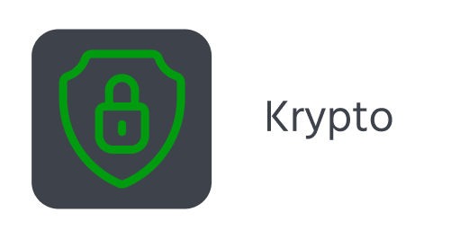

This is an app for Android to en- or decrypt messages.

Data privacy issues are of concern to users around the world. I propose a simple solution to keep
your correspondence private.

## Table of contents

- [How does it work](#How-does-it-work)
- [Screenshots](#Screenshots)
- [Technologies](#Technologies)
- [Development progress](#Development-progress)
- [Project statistics](#Project-statistics)
- [How to install](#How-to-install)
- [How to contribute](#How-to-contribute)

## How does it work

The user creates correspondence – an object containing an encryption method, a key and the ability
to automatically copy messages to the clipboard. After that, the user can paste the copied text into
any messenger.

In order for the recipient to be able to decrypt the sent message, he needs to know the key. It’s
recommended that you report the key in person.

If you are interested in how ciphers work, you can find out in this app.

## Screenshots

*All screenshots are relevant for version 2.0*

Screen of all correspondences (home screen):

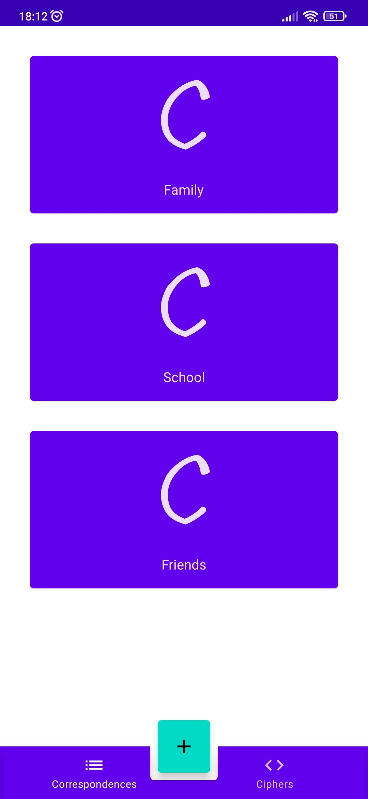

Screen of all ciphers:

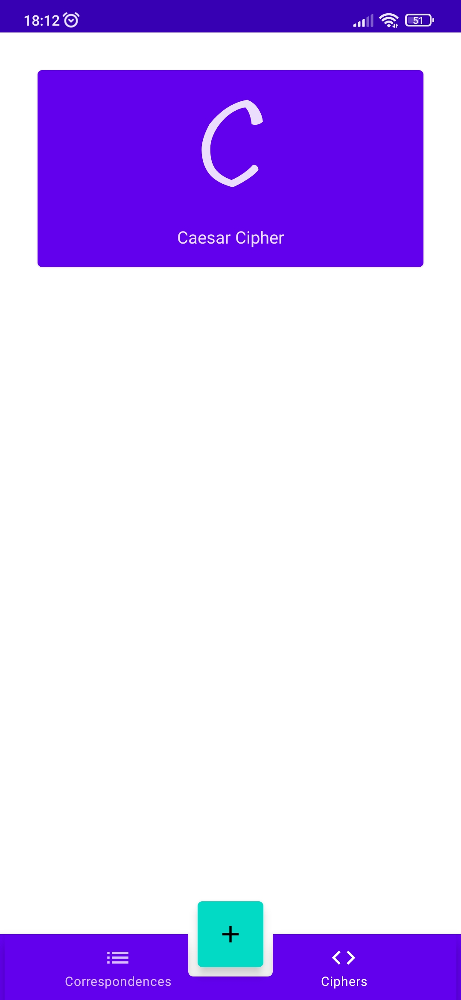

Screen with info about Caesar Cipher:

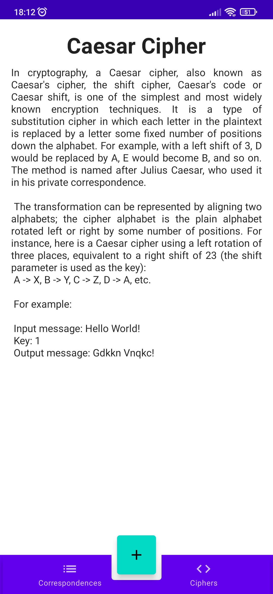

Creating new correspondence screen (select cipher):

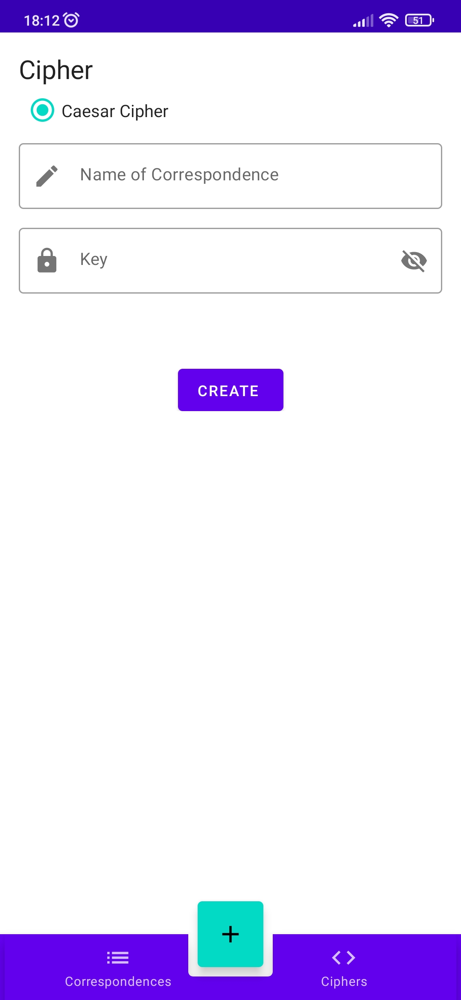

Creating new correspondence screen (input name):

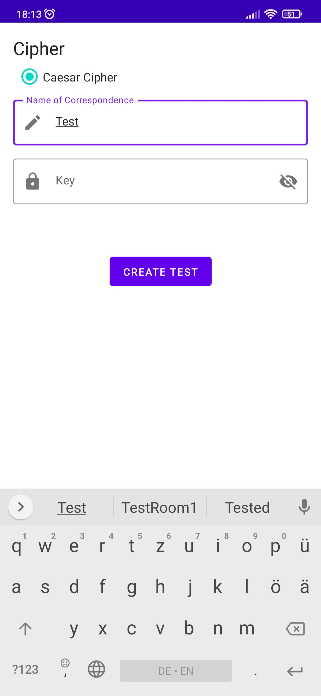

Creating new correspondence screen (input key (not visible)):

Creating new correspondence screen (input key (visible)):

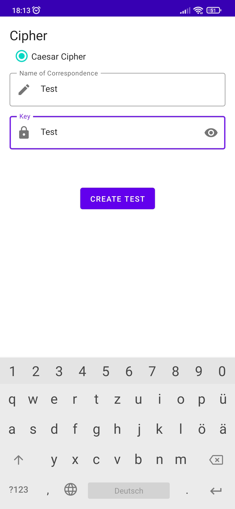

On the button CREATE click:

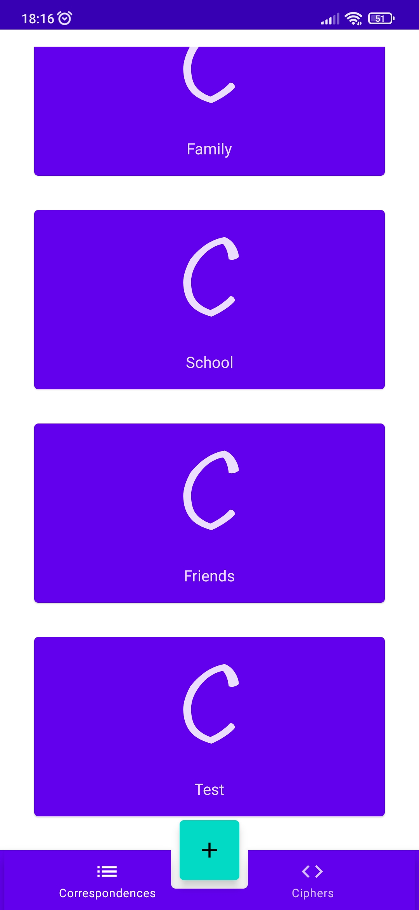

New correspondence screen:

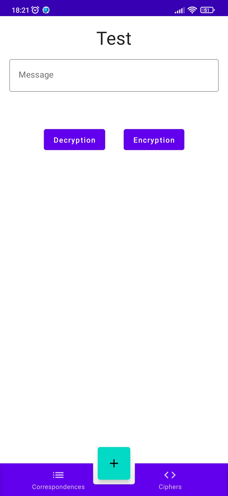

New correspondence screen (input message):

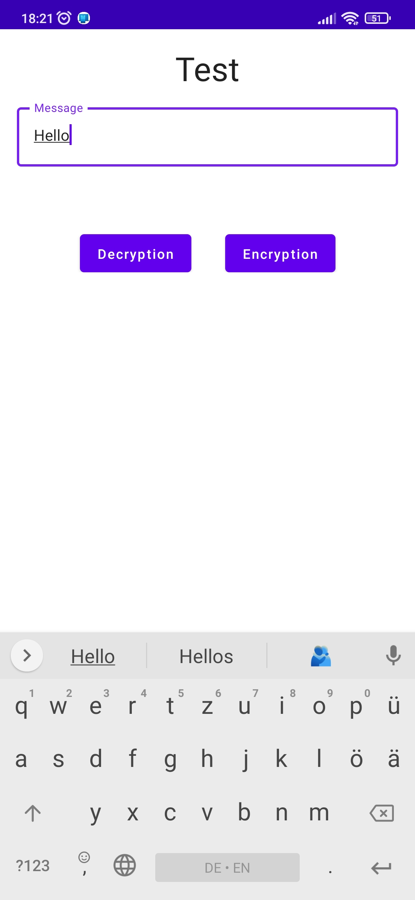

New correspondence screen (encryption):

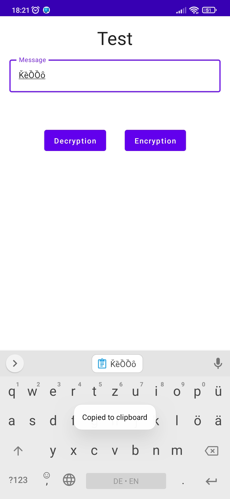

Dialog to remove the correspondence (after long click on the correspondence):

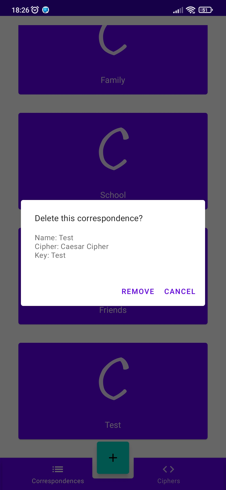

After removing the correspondence:

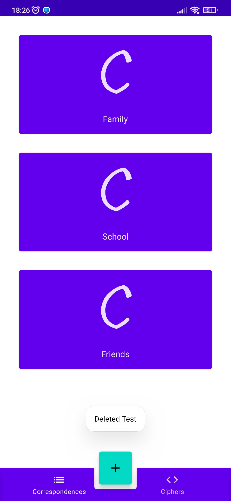

## Technologies

- The programming
  language [Kotlin](https://kotlinlang.org/) ([AdoptOpenJDK version 11.0.10](https://adoptopenjdk.net/))
  was chosen for development.

- Development was carried out in [Android Studio](https://developer.android.com/studio/).

- [The Room persistence library](https://developer.android.com/jetpack/androidx/releases/room) was
  used to interact with a database.

- [Jetpack Compose toolkit](https://developer.android.com/jetpack/compose) was used for building
  native UI.

- [Figma](https://www.figma.com/) was used to prototype the user interface.

- [WakaTime](https://wakatime.com/) was used to track activity.

- [Microsoft To Do](https://todo.microsoft.com/tasks/) was used to schedule tasks.

- [Flaticon](https://www.flaticon.com/free-icons/security) was used to create the logo.

## Development progress

Development of the project began on **Mar 10, 2021**.

Main problems:

- Scary UI

- Little of ciphers

- Insecure ciphers

Currently implemented ciphers:

- [Caesar cipher](https://github.com/VitasSalvantes/Simple-Examples#caesarcipher)

*Since I am developing this project mainly alone, I see no reason to
use [Trello](https://trello.com/).*

## Project statistics

See more on [WakaTime](https://wakatime.com/@VitasSalvantes/projects/xemqmsfaet).

## How to install

1. Download the repository code as a zip archive
2. Unpack the zip archive
3. Open the unpacked project with Android Studio
4. Run the project

## How to contribute

If you want to take part in the development of this project, please
read [this](/CONTRIBUTING.md) file.
