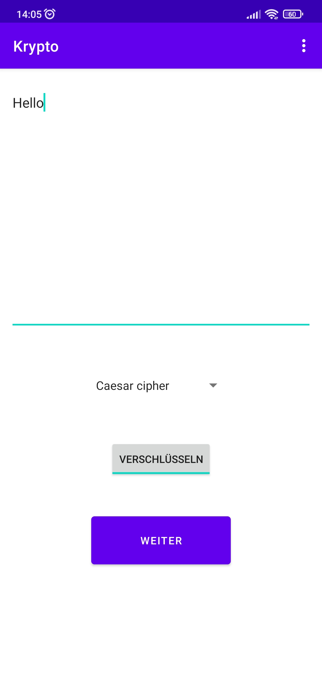
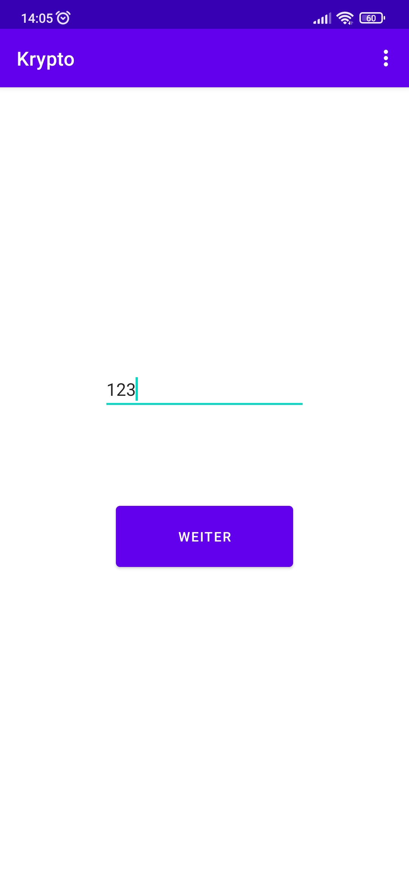
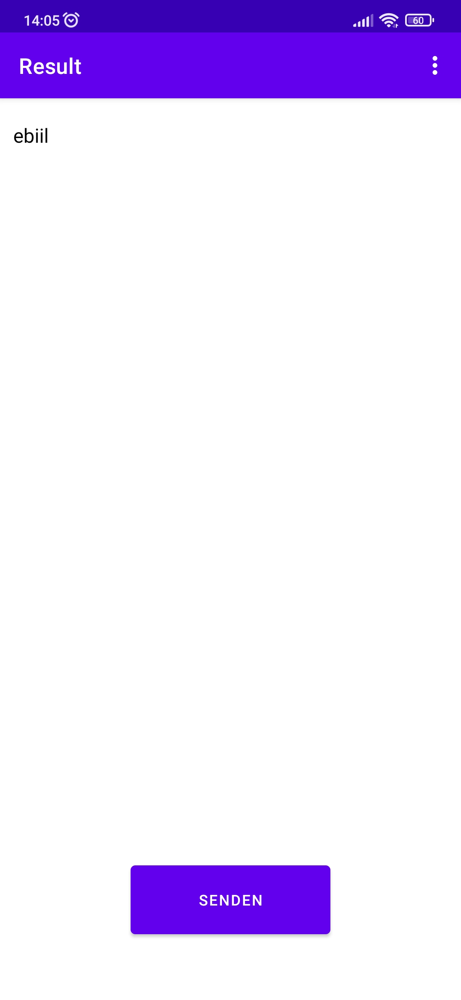
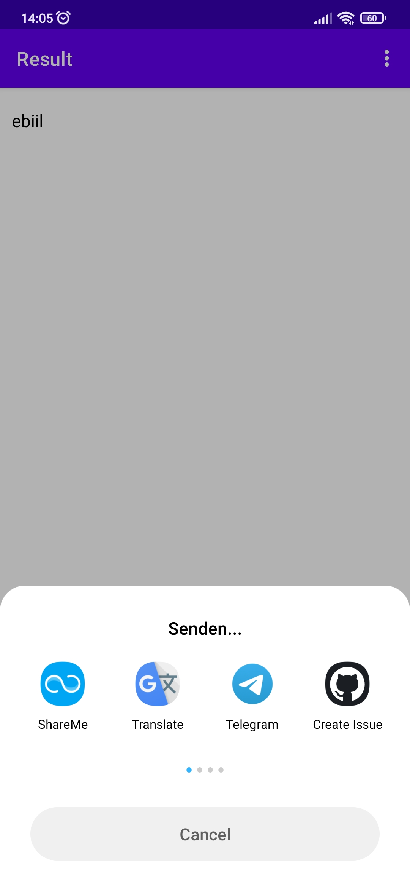
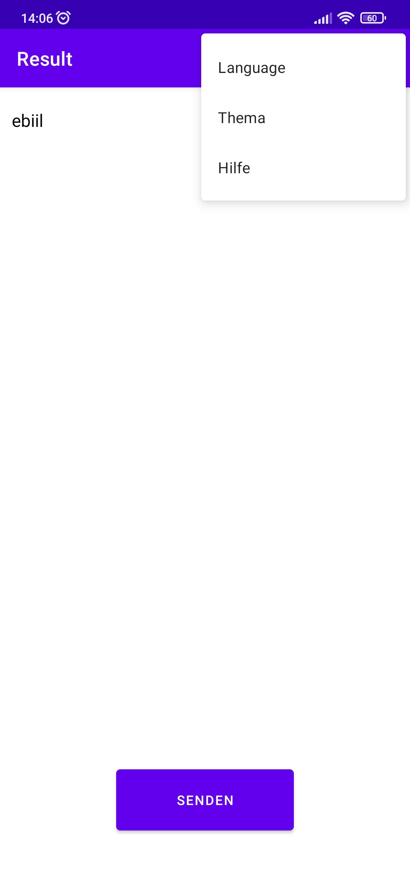

# Krypto

Tired of constant leaks of messenger databases? Do you want to correspond with your friends and
family ones without fear of surveillance? Protect your privacy with Krypto!

## Table of contents

- [How does it work](#How-does-it-work)
- [Screenshots](#Screenshots)
- [Technologies](#Technologies)
- [Development progress](#Development-progress)
- [Project statistics](#Project-statistics)
- [How to install](#How-to-install)
- [How to contribute](#How-to-contribute)

## How does it work

Krypto is an app for **Android devices** that allows you to **encrypt any text** (for example,
message or email). Since messages **are not sent to the server** and are **not saved on the device**
, your data remains **completely safe**.

## Screenshots

*All screenshots are relevant for version 1.0*

At the beginning:

After click on the "WEITER" button:

After click on the "WEITER" button:

After click on the "SENDEN" button:

After click on the menu button:

## Technologies

- The programming
  language [Kotlin](https://kotlinlang.org/) ([AdoptOpenJDK version 11.0.10](https://adoptopenjdk.net/))
  was chosen for development.

- Development was carried out in [Android Studio](https://developer.android.com/studio/).

- [Figma](https://www.figma.com/) was used to prototype the user interface.

- [WakaTime](https://wakatime.com/) was used to track activity.

- [Microsoft To Do](https://todo.microsoft.com/tasks/) was used to schedule tasks.

## Development progress

Development of the project began on **Mar 10, 2021**.

Currently implemented ciphers:

- [Atbash cipher](https://github.com/VitasSalvantes/Simple-Examples#atbashcipher)
- [Caesar cipher](https://github.com/VitasSalvantes/Simple-Examples#caesarcipher)
- [Code word cipher](https://github.com/VitasSalvantes/Simple-Examples#codewordcipher)

*Since I am developing this project mainly alone, I see no reason to
use [Trello](https://trello.com/).*

## Project statistics

See more on [WakaTime](https://wakatime.com/@VitasSalvantes/projects/xemqmsfaet).

## How to install

1. Download the repository code as a zip archive
2. Unpack the zip archive
3. Open the unpacked project with Android Studio
4. Run the project

## How to contribute

If you want to take part in the development of this project, please
read [this](https://github.com/VitasSalvantes/Krypto/blob/master/CONTRIBUTING.md) file.
